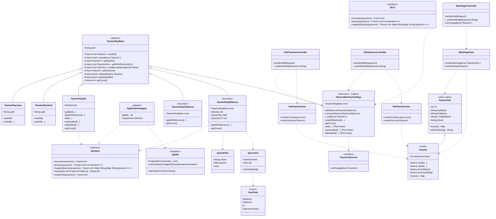

# Class Diagram – Lab 3

```mermaid
classDiagram
  %% ===== DOMAIN =====
  class TeacherInfo {
    <<value object>>
    +int? id
    +String lastName
    +String firstName
    +String? middleName
    +String phone
    +toJson() Map
    +toShortString() String
  }

  class Teacher {
    <<entity>>
    +int experienceYears
    +factory create(...)
    +factory withId(...)
    +factory from(Object)
    +factory fromJson(Map)
    +toJson() Map
  }

  TeacherInfo <|-- Teacher

  %% ===== REPOSITORY CONTRACT =====
  class TeacherRepBase {
    <<abstract>>
    +String path
    +Future~List~Teacher~~ readAll()
    +Future~void~ writeAll(List~Teacher~)
    +Future~Teacher?~ getById(int)
    +Future~List~TeacherInfo~~ getKthNShortList(k,n)
    +Future~List~Teacher~~ sortByLastName(persist=false)
    +Future~Teacher~ add(Teacher)
    +Future~bool~ replaceById(int,Teacher)
    +Future~bool~ deleteById(int)
    +Future~int~ getCount()
  }

  %% ===== FILE REPOS =====
  class TeacherRepJson {
    +String path
    +readAll()
    +writeAll(...)
  }

  class TeacherRepYaml {
    +String path
    +readAll()
    +writeAll(...)
  }

  TeacherRepBase <|-- TeacherRepJson
  TeacherRepBase <|-- TeacherRepYaml

  %% ===== DB PORT & ADAPTER =====
  class DbTx {
    <<interface>>
    +execute(sql,params) Future~int~
    +query(sql,params) Future~List~List~dynamic~~~ 
    +mappedQuery(sql,params) Future~List~Map~String,Map~String,dynamic~~~~
  }

  class DbClient {
    <<interface>>
    +execute(sql,params) Future~int~
    +query(sql,params) Future~List~List~dynamic~~~ 
    +mappedQuery(sql,params) Future~List~Map~String,Map~String,dynamic~~~~
    +transaction~R~(Future~R~(DbTx)) Future~R~
    +scalarInt(sql,params) Future~int~
  }

  class AppDb {
    <<singleton>>
    -PostgreSQLConnection _conn
    +open/openFromEnv/close()
    +execute/query/mappedQuery/transaction/scalarInt
  }

  class PgDbClientAdapter {
    <<adapter>>
    -AppDb _db
    +implements DbClient
  }

  class TeacherRepDb {
    +DbClient db
    +getById(...)
    +getKthNShortList(...)
    +add(...)
    +replaceById(...)
    +deleteById(...)
    +getCount()
  }

  TeacherRepBase <|-- TeacherRepDb
  TeacherRepDb ..> DbClient
  PgDbClientAdapter ..|> DbClient
  PgDbClientAdapter ..> AppDb

  %% ===== DECORATORS =====
  class TeacherRepFileDecor {
    <<decorator>>
    +TeacherRepBase inner
    +getKthNShortList(...)
    +getCount()
  }

  class TeacherRepDbDecor {
    <<decorator>>
    +TeacherRepBase inner
    +DbClient db
    +QueryFilter filter
    +QuerySort? sort
    +getKthNShortList(...)
    +getCount()
  }

  TeacherRepBase <|-- TeacherRepFileDecor
  TeacherRepBase <|-- TeacherRepDbDecor
  TeacherRepDbDecor ..> DbClient

  class QueryFilter {
    +String where
    +Map params
    +none
  }

  class QuerySort {
    +SortField field
    +bool asc
    +toOrderBySql()
  }

  class SortField {
    <<enum>>
    lastName
    firstName
    id
    experienceYears
  }

  TeacherRepDbDecor ..> QueryFilter
  TeacherRepDbDecor ..> QuerySort
  QuerySort ..> SortField

  %% ===== OBSERVER DECORATOR =====
  class TeacherObserver {
    <<interface>>
    +onChanged(List~Teacher~)
  }

  class ObservableTeacherRepo {
    <<decorator + subject>>
    +TeacherRepBase inner
    +addObserver(TeacherObserver)
    +removeObserver(TeacherObserver)
    +_notify(List~Teacher~)
    +readAll()/writeAll(...)
    +getCount()
    +add(...) *(from base)*
    +replaceById(...) *(from base)*
    +deleteById(...) *(from base)*
  }

  TeacherRepBase <|-- ObservableTeacherRepo
  ObservableTeacherRepo ..> TeacherObserver

  %% ===== PRESENTATION =====
  class MainPageController {
    +handle(HttpRequest)
    +_writeHtml(HttpResponse,String)
    +onChanged(List~Teacher~)
  }

  class AddTeacherController {
    +handle(HttpRequest)
    +_writeHtml(HttpResponse,String)
  }

  class EditTeacherController {
    +handle(HttpRequest,int)
    +_writeHtml(HttpResponse,String)
  }

  class MainPageView {
    +renderMainPage(List~TeacherInfo~)
    +renderDetails(Teacher)
  }

  class AddTeacherView {
    +renderForm(values,error)
    +renderSuccess(Teacher)
  }

  class EditTeacherView {
    +renderForm(id,values,error)
    +renderSuccess(Teacher)
  }

  MainPageController ..> ObservableTeacherRepo
  MainPageController ..> MainPageView
  AddTeacherController ..> ObservableTeacherRepo
  AddTeacherController ..> AddTeacherView
  EditTeacherController ..> ObservableTeacherRepo
  EditTeacherController ..> EditTeacherView
  MainPageView ..> TeacherInfo
  MainPageView ..> Teacher
  AddTeacherView ..> Teacher
  EditTeacherView ..> Teacher
```
