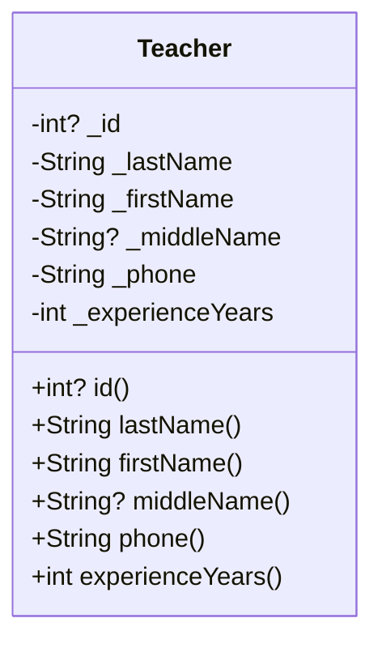

# Short Class Diagram

```mermaid
classDiagram
  class Teacher {
    -int? _id
    -String _lastName
    -String _firstName
    -String? _middleName
    -String _phone
    -int _experienceYears
    +int? id()
    +String lastName()
    +String firstName()
    +String? middleName()
    +String phone()
    +int experienceYears()
  }
```
