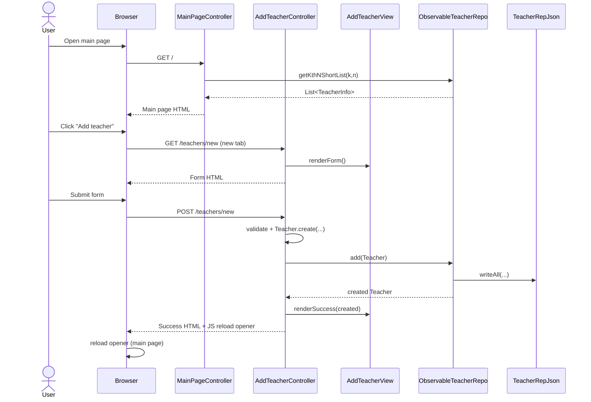

# Add Teacher Sequence Diagram

```mermaid
sequenceDiagram
  actor User
  participant Browser
  participant MainPageController
  participant AddTeacherController
  participant AddTeacherView
  participant Repo as ObservableTeacherRepo
  participant Store as TeacherRepJson

  User->>Browser: Open main page
  Browser->>MainPageController: GET /
  MainPageController->>Repo: getKthNShortList(k,n)
  Repo-->>MainPageController: List<TeacherInfo>
  MainPageController-->>Browser: Main page HTML

  User->>Browser: Click "Add teacher"
  Browser->>AddTeacherController: GET /teachers/new (new tab)
  AddTeacherController->>AddTeacherView: renderForm()
  AddTeacherController-->>Browser: Form HTML

  User->>Browser: Submit form
  Browser->>AddTeacherController: POST /teachers/new
  AddTeacherController->>AddTeacherController: validate + Teacher.create(...)
  AddTeacherController->>Repo: add(Teacher)
  Repo->>Store: writeAll(...)
  Repo-->>AddTeacherController: created Teacher
  AddTeacherController->>AddTeacherView: renderSuccess(created)
  AddTeacherController-->>Browser: Success HTML + JS reload opener
  Browser->>Browser: reload opener (main page)
```
