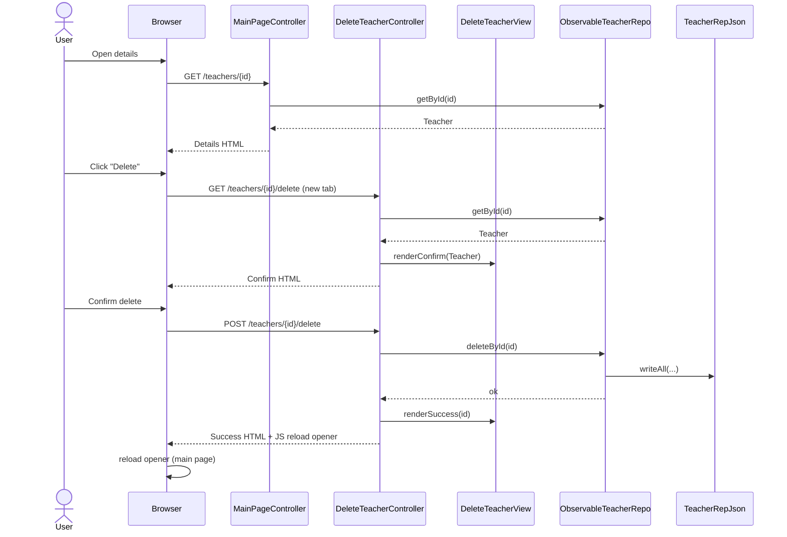

# Delete Teacher Sequence Diagram

```mermaid
sequenceDiagram
  actor User
  participant Browser
  participant MainPageController
  participant DeleteTeacherController
  participant DeleteTeacherView
  participant Repo as ObservableTeacherRepo
  participant Store as TeacherRepJson

  User->>Browser: Open details
  Browser->>MainPageController: GET /teachers/{id}
  MainPageController->>Repo: getById(id)
  Repo-->>MainPageController: Teacher
  MainPageController-->>Browser: Details HTML

  User->>Browser: Click "Delete"
  Browser->>DeleteTeacherController: GET /teachers/{id}/delete (new tab)
  DeleteTeacherController->>Repo: getById(id)
  Repo-->>DeleteTeacherController: Teacher
  DeleteTeacherController->>DeleteTeacherView: renderConfirm(Teacher)
  DeleteTeacherController-->>Browser: Confirm HTML

  User->>Browser: Confirm delete
  Browser->>DeleteTeacherController: POST /teachers/{id}/delete
  DeleteTeacherController->>Repo: deleteById(id)
  Repo->>Store: writeAll(...)
  Repo-->>DeleteTeacherController: ok
  DeleteTeacherController->>DeleteTeacherView: renderSuccess(id)
  DeleteTeacherController-->>Browser: Success HTML + JS reload opener
  Browser->>Browser: reload opener (main page)
```
