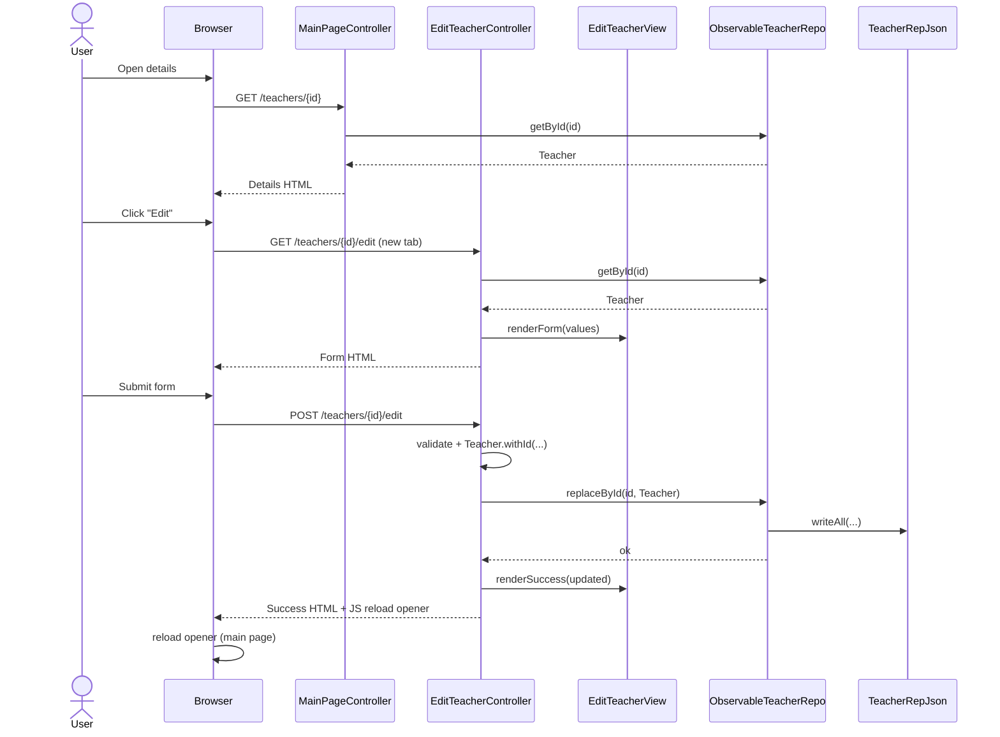

# Edit Teacher Sequence Diagram

```mermaid
sequenceDiagram
  actor User
  participant Browser
  participant MainPageController
  participant EditTeacherController
  participant EditTeacherView
  participant Repo as ObservableTeacherRepo
  participant Store as TeacherRepJson

  User->>Browser: Open details
  Browser->>MainPageController: GET /teachers/{id}
  MainPageController->>Repo: getById(id)
  Repo-->>MainPageController: Teacher
  MainPageController-->>Browser: Details HTML

  User->>Browser: Click "Edit"
  Browser->>EditTeacherController: GET /teachers/{id}/edit (new tab)
  EditTeacherController->>Repo: getById(id)
  Repo-->>EditTeacherController: Teacher
  EditTeacherController->>EditTeacherView: renderForm(values)
  EditTeacherController-->>Browser: Form HTML

  User->>Browser: Submit form
  Browser->>EditTeacherController: POST /teachers/{id}/edit
  EditTeacherController->>EditTeacherController: validate + Teacher.withId(...)
  EditTeacherController->>Repo: replaceById(id, Teacher)
  Repo->>Store: writeAll(...)
  Repo-->>EditTeacherController: ok
  EditTeacherController->>EditTeacherView: renderSuccess(updated)
  EditTeacherController-->>Browser: Success HTML + JS reload opener
  Browser->>Browser: reload opener (main page)
```
